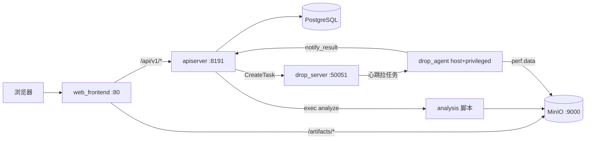
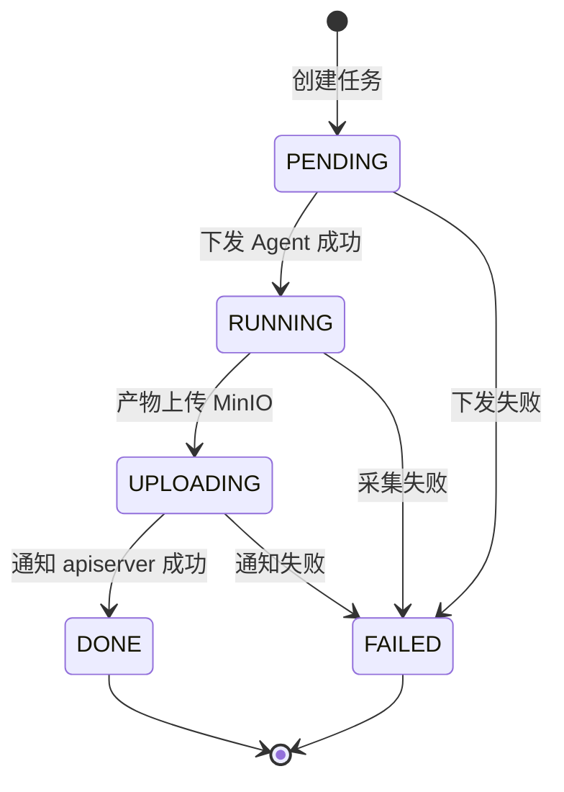

# Mini-Drop 设计文档

> 项目：Mini-Drop 性能分析平台复刻（3 天 MVP + ECS 验收）  
> 部署环境：Ubuntu 22.04 / Docker Compose / 阿里云 ECS `47.113.102.23`  
> 最后同步：2026-06-20（与 answer8–10 验收结果一致）

---

## 1. 总体架构

Mini-Drop 采用 **Web → apiserver → drop → analysis** 四层结构，PostgreSQL 存任务状态，MinIO 存 perf 产物与火焰图。



### 1.1 组件职责

| 组件 | 技术 | 职责 |
|------|------|------|
| web_frontend | React + Vite + nginx | 建任务、Agent 列表、任务详情（火焰图 / TopN / 归因） |
| apiserver | Go + Gin + GORM | REST API、状态机、调度 drop、触发 analysis |
| drop_server | Python + FastAPI | 任务队列、Agent 心跳、结果回调 |
| drop_agent | Python | perf / py-spy / bpftrace 采集，上传 MinIO |
| analysis | Python + FlameGraph | perf.data → flamegraph.svg + top.json |
| postgres | PostgreSQL 14 | tasks、task_status_history、agent_audit |
| minio | MinIO | 对象存储 bucket `drop` |

### 1.2 端口与访问

| 服务 | 端口 | 说明 |
|------|------|------|
| web_frontend | 80 | 首页 / 任务列表 / 详情 |
| apiserver | 8191 | REST API，`/healthz` |
| drop_server | 50051 | 控制面 HTTP（非 gRPC） |
| minio | 9000 / 9001 | 数据 / Console |
| postgres | 5432 | 开发环境暴露 |

外网演示需安全组放行 **80、8191**（9000 可选）。火焰图通过 nginx 路径 `/artifacts/{tid}/flamegraph.svg` 反代 MinIO，避免浏览器直连 localhost。

---

## 2. 关键设计决策

| 决策 | 选择 | 原因 |
|------|------|------|
| drop 实现语言 | **Python** 替代官方 C++ | 3 天工期；HTTP/JSON 语义对齐 proto，不用 gRPC |
| 控制面协议 | FastAPI HTTP | 联调快；`dropclient` 调 `/control/create_task` |
| 存储 | **MinIO** 替代 COS | 本地/ECS 一键 compose |
| apiserver 运行时 | **Ubuntu 22.04**（含 perf + FlameGraph） | Alpine 缺 perf，无法跑 `hotmethod_analyzer` |
| 镜像下载 | 国内源（阿里云 apt/pip、npmmirror、gitee FlameGraph、goproxy.cn） | ECS 访问国外源超时 |
| LLM | DeepSeek API + 固定 tools | 混元不可用；无 Key 时规则降级 |
| 自然语言采集 | **未做** | 写入「若有 7 天」 |

官方 Drop 约 5 万行；本仓库 MVP 约 **6k–8.5k 行**，用文档说明取舍，不冒充完整复刻。

---

## 3. 任务状态机

状态与官方一致：`PENDING → RUNNING → UPLOADING → DONE`，任意阶段可 `FAILED`。每次迁移写入 `task_status_history`，带 `reason` 字段。



实现位置：

- 合法性：`apiserver/internal/state/state.go` 的 `CanTransition`
- 落库：`handlers.transition()` 更新 `tasks` 并插入 `task_status_history`
- Web 展示：详情页折叠区展示 history（字段 `FromSt` / `ToSt` / `Reason`）

**数据库说明**：GORM 将任务 ID 列映射为 `t_id`（非 `tid`），查询需用 `t_id`，JSON 对外仍叫 `tid`。

**分析状态**：`tasks.analysis_status` 独立于主状态机；`pending` → 调用 `/analyze` 成功后为 `done`。

---

## 4. 核心数据流（perf 全链路）

已验收任务示例：**TID `98b6424f`**（ECS 2026-06-19）。

1. **建任务**：`POST /api/v1/tasks` → apiserver 写库 → `drop_server` 按 `target_ip` 入队  
2. **Agent 拉任务**：每 5s `POST /healthcheck/do`；若队列 key 为 `127.0.0.1` 而 Agent 上报 ECS 内网 IP，server 会**回退**从 `127.0.0.1` 队列取任务（`drop/server.py` 已修）  
3. **采集**：`perf record` → 本地 `/tmp/minidrop/{tid}/perf.data`  
4. **上传**：MinIO key `{tid}/perf.data`  
5. **回调**：Agent → apiserver `POST /api/v1/internal/task_result` → 状态 `UPLOADING` → `DONE`  
6. **分析**：`POST /api/v1/tasks/{tid}/analyze` → apiserver 容器内跑 `hotmethod_analyzer.py` → 上传 `{tid}/flamegraph.svg`、`{tid}/top.json`  
7. **展示**：前端 iframe 加载 `/artifacts/{tid}/flamegraph.svg`

**注意**：对 **pid=1、采样 5s** 的任务（如 `99ccee16`），perf 栈计数可能为 0，analyze 会失败。演示应对**有 CPU 负载的进程**采样（验收脚本用 `python3 -c "while True: pass"`）。

---

## 5. API 清单（MVP 8 个）

| 方法 | 路径 | 说明 |
|------|------|------|
| GET | `/healthz` | 健康检查 |
| GET | `/api/v1/agents?target_ip=` | Agent 在线状态 |
| POST | `/api/v1/tasks` | 创建采样任务 |
| GET | `/api/v1/tasks` | 任务列表 |
| GET | `/api/v1/tasks/:tid` | 任务详情 + history |
| POST | `/api/v1/tasks/:tid/analyze` | 触发火焰图分析 |
| POST | `/api/v1/internal/task_result` | Agent/Server 回调 |
| — | drop `/control/create_task` | apiserver 内部调用 |

官方指南约 12 个 API；MVP 未做 JWT 全量鉴权、自然语言接口等。

### 5.1 前端 API 约定

- 任务详情：`GET /api/v1/tasks/:tid`（**勿用** `/tasks/result?tid=`，已废弃）  
- 静态产物：`/artifacts/{tid}/flamegraph.svg`、`/artifacts/{tid}/top.json`（nginx → MinIO bucket `drop`）

---

## 6. drop 与 Agent

### 6.1 drop_server

- FastAPI，端口 50051  
- `/control/create_task`：按 `target_ip` 入队  
- `/healthcheck/do`：更新 Agent 表、下发 pending 任务  
- `/hotmethod/notify_result`：记录结果（Agent 同时调 apiserver）  
- 内存审计 `_audit`；离线 watchdog 每 10s 检查（简化版，非完整 30s 持久审计）

### 6.2 drop_agent

- `network_mode: host` + `privileged` + `pid: host`  
- 心跳间隔 **5s**（`HEARTBEAT_SEC`）  
- 采集器：`perf`（默认）、`pyspy`、`bpftrace`  
- **Continuous Profiling**：后台每 60s 采 10s perf → MinIO `cp/{unix_ts}/perf.data`（已在 ECS 运行，Web 时间轴 UI 未完整）

### 6.3 Dockerfile 要点

- Ubuntu 22.04 + 阿里云 apt  
- `linux-tools-5.15.0-179-generic`（与 ECS 内核匹配）  
- pip 使用 `mirrors.aliyun.com`

---

## 7. analysis 分析链

入口：`analysis/hotmethod_analyzer.py`

1. 从 MinIO 下载 `perf.data`  
2. `perf script` → `stackcollapse-perf.pl` → `flamegraph.pl`（FlameGraph 来自 gitee 镜像）  
3. 生成 `top.json`（TopN）、`suggestions.md`（规则，本地）  
4. 上传 `flamegraph.svg`、`top.json` 到 MinIO  

apiserver 通过 `exec` 调用上述脚本，需容器内具备 **perf、perl、python3、minio 库**。

---

## 8. 扩展能力实现度

| 能力 | 实现 | Web 展示 | 说明 |
|------|------|----------|------|
| perf 火焰图 | ✅ | ✅ iframe SVG | 全链路已验收 |
| py-spy | ✅ 采集器代码 | ⚠️ 详情页未单独 Tab | 可扩展 |
| bpftrace | ✅ 采集器代码 | ⚠️ 曾为 ECharts 演示 | 演示视频需现场 dd/fio |
| Continuous Profiling | ✅ Agent 后台上传 | ⚠️ 无 5 分钟时间轴 | MinIO `cp/` 已有数据 |
| 智能归因 | ✅ `llm_attribution.py` + 规则 | ✅ TopN/归因 Tab | 无 Key 时规则降级；详见 `LLM_EVAL.md` |
| 自然语言采集 | ❌ | — | 列入 §11 |

---

## 9. 部署与运维

### 9.1 一键启动

```bash
cd project1_MiniDrop   # 或 ECS: /opt/minidrop
docker compose up -d --build
make demo              # 等价 compose up
```

### 9.2 环境要求

- Linux（Ubuntu 22.04 推荐），Docker + Compose  
- `kernel.perf_event_paranoid <= 1` 或 Agent 容器 privileged  
- Agent 需与宿主机 **内核版本匹配的 linux-tools**（ECS 为 5.15.0-179）  
- 可选：`DEEPSEEK_API_KEY` 启用 LLM 归因  

### 9.3 ECS 踩坑摘要（已解决）

| 问题 | 处理 |
|------|------|
| Docker Hub / PyPI / Go proxy 超时 | daemon 镜像加速 + Dockerfile 国内源 |
| tasks 表缺列 / 列名 t_id | GORM AutoMigrate + handlers 查 `t_id` |
| drop_server `_offline_watchdog` 拼写 | 已修 |
| 任务 queued 在 127.0.0.1、Agent IP 不匹配 | healthcheck 回退队列 |
| apiserver 无 perf | 运行时改 Ubuntu + linux-tools |
| 前端错误 API 路径 / localhost MinIO | api.js + nginx `/artifacts/` |

---

## 10. 测试与质量

| 类型 | 位置 | 现状 |
|------|------|------|
| 状态机单测 | `apiserver/internal/state/state_test.go` | ✅ |
| TopN 单测 | `tests/test_topn.py` | ✅ |
| E2E 脚本 | `tests/e2e/run_e2e.sh`（正常 / 坏 pid / 错 IP） | ✅ 需 Linux + jq |
| 全链路脚本 | `tests/e2e/verify_chain.sh`、`verify_analyze.sh` | ✅ ECS 用过 |

**诚实说明**：官方要求单测覆盖率 ≥50%、3 个 E2E；当前覆盖率**未达到 50%**，E2E 脚本已有但 CI 未接入。交付时在 README/答辩中如实说明 MVP 范围。

---

## 11. 性能自证（目标 vs 实测）

| 指标 | 目标 | ECS 实测（2026-06-19/20） |
|------|------|---------------------------|
| compose 冷启动 | < 10 min | 首次约 15–20 min（含拉镜像）；镜像缓存后 < 2 min |
| pip install（drop） | — | 国内源约 **18s**（原 PyPI 7min+） |
| 10s perf 采集 + 上传 | — | 约 15s（任务 98b6424f） |
| analyze 出图 | < 60s | 数秒内（有有效 perf 栈时） |

---

## 12. AI 协作方式

- **DeepSeek**：讨论计划、生成给 Cursor 的提示词；答复记录在 `Deepseek/answer1.txt` … `answer10.txt`  
- **Cursor**：代码骨架、ECS 部署、验收脚本、文档同步  
- **学生**：确认架构取舍、安全组、演示脚本  

设计文档与 `structure.txt`、最新 `answerN.txt` 一并给 DeepSeek 保持上下文。

---

## 13. 演示视频提纲（≤ 15 min）

1. `docker compose ps` + 首页 Agent 在线  
2. 新建采样（建议 CPU 密集进程，非 pid=1）  
3. 详情页：状态迁移 → 生成火焰图 → SVG 展示  
4. TopN / 归因 Tab  
5. （可选）`dd` 触发 IO + bpftrace 说明  
6. MinIO `cp/` 说明 Continuous Profiling  
7. 最得意设计：**国内镜像 + 任务队列 IP 回退**；若重做：drop 迁 gRPC、补 JWT、CP 时间轴 UI  

---

## 14. 若有 7 天我会做什么

1. drop 迁回 **C++ + gRPC**，对齐官方 proto  
2. apiserver 补全 **12 API + JWT**  
3. Web：**CP 5 分钟时间轴**、bpftrace 实时图表、py-spy 独立 Tab  
4. **自然语言采集**加分项  
5. 单测覆盖率到 50%+，E2E 进 CI  
6. d3 交互火焰图；生产级 CP 切割策略  

---

## 15. 相关文档

- 官方题目：`INITIAL/Mini-Drop+题目.md`  
- 执行计划：`PLAN.md`  
- 智能归因：`docs/LLM_EVAL.md`  
- 验收记录：`Deepseek/answer6.txt`–`answer10.txt`  
- 快速开始：`README.md`  
